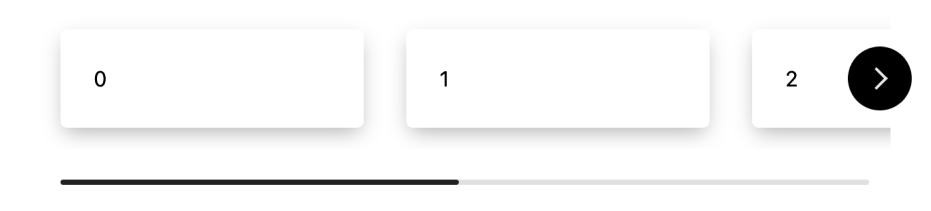

<p align="center"></p>

<h1 align="center">Gitart Vue Carousel</h1>

<p align="center">Vue 3 Carousel Component</p>

---

📘 [Documentation](https://gitart-scroll-carousel.gitart.org/)

🤯 [Demo](https://gitart-scroll-carousel.gitart.org/demo/)

⭐ [GitHub](https://github.com/gitart-group/scroll-carousel) | Thanks for the stars!

<a href="https://www.npmjs.com/package/gitart-scroll-carousel" target="_blank" rel="noopener noreferrer">
  
</a>

## Getting started

```bash
npm install gitart-scroll-carousel
```

## Demo

[Link to demo](https://gitart-scroll-carousel.gitart.org/demo/)

<p align="center"></p>

Read documentation for more information. <br />
[gitart-scroll-carousel.gitart.org](https://gitart-scroll-carousel.gitart.org/)